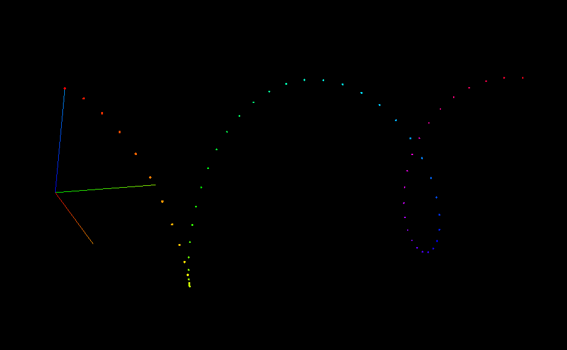

# ramon [](/LICENSE)

> *tell why the glassy lights* [...]  
> *Mastered the night and portioned out the sea,*  
> *Fixing emblazoned zones and fiery poles,*  
> *Arranging, deepening, enchanting night.*

*Ramon Fernandez*, or *ramon* for short, is a visualization utility born from a specific, opinionated methodology for mapping "data" (a nebulous, all-encompassing term) to visual spaces.

```javascript
new ramon.World(data, ramon.Sphere)
  .set('radius', () => 1)
  .set('color', (_, i) => {
      return `hsl(${360*i/data.length}, 100%, 50%)`;
  })
  .set('position', (_, i) => {
      return [
          Math.cos(2*Math.PI*i/data.length), // x
          i/2,                               // y
          Math.sin(2*Math.PI*i/data.length)  // z
      ];
  })
  .make();
```

## Concepts

### Data are tuples

A *datum* is some values in a semantic context. *ramon* opines that a low-nonsense representation is that data are simply flat tuples (specifically, tuples not containing variable-length fields, as in BigQuery, or nested fields; since nested fields are a convenience, they are easy to hand-wave away; repeated fields can be waved away with more work).

For precise concepts, it is best to turn to the tuple relational calculus: "tuples" as partial maps from "attribute names" to corresponding "domains" of "atomic values"; tables of tuples under a "heading" as "relations," etc., etc. So much for data manipulation.

### Visualizations are functions from data to objects in 3D space

I mean 3D in the sense of Euclidean space. 3D objects themselves have their own additional dimensions (color, width, size, etc.). Moreover, for the purposes of visualization, it may not even be important that they are in 3D as opposed to 2D. Indeed, it is only via *trompe-l'oeil* that computers seem to show us 3D.

On the other hand, it would be odd to talk of visualizations in 4 spatial dimensions, since we'd only see (approximately) 3d slices of these at a time. To quote Ivan Fyodorovich, "I have a Euclidian earthly mind, and how could I solve problems that are not of this world?"

### Visualization is a hylomorphism
In the functional sense, of course. An *anamorphism* (unfolding of WebGL attribute buffers from a single dataset) followed by a *catamorphism* (folding of the attribute buffers into an `Object3D`). The only reason to reason about visualization in this way is for the philosophical pun that follows:

### Objects in 3D space are hylomorphisms
In the Aristotelian sense, of course. They are composed of a `geometry` and `material` in three.js, and of a form (μορφή) and matter (ὕλη) in Aristotle's *Physics*. They have an essence (οὐσία) too, a composite of the geometry and material.

---

In sum, from arrays of data and functions from data to spatial/visual dimensions, a visualization may be created. This is, at a high level, what the excellent [D3](https://d3js.org/) library allows developers to express tersely, and to recreate such terseness is *ramon*'s aim.


